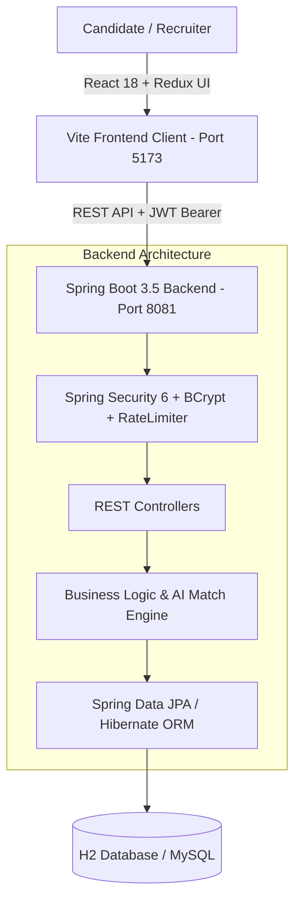

# 🚀 Hire Via — Full-Stack Job Portal & AI Talent Platform

[](https://spring.io/projects/spring-boot)
[](https://www.oracle.com/java/)
[](https://reactjs.org/)
[](https://vitejs.dev/)
[](https://tailwindcss.com/)
[](https://redux-toolkit.js.org/)
[](https://spring.io/projects/spring-security)
[](LICENSE)

> **Hire Via** is an intelligent, full-stack recruitment platform and Applicant Tracking System (ATS) connecting job seekers with hiring companies. Built with **React 18** and **Spring Boot 3.5**, it features automated **AI Job Matching**, **1-Click AI Cover Letters**, **Real-Time Application Tracking**, and **Role-Based Security**.

---

## 📌 Table of Contents
- [✨ Key Features](#-key-features)
- [🤖 AI Features](#-ai-features)
- [🛠️ Tech Stack](#️-tech-stack)
- [🏗️ System Architecture](#️-system-architecture)
- [🚀 Quick Start Guide (Run Locally)](#-quick-start-guide-run-locally)
- [📡 Key API Endpoints](#-key-api-endpoints)
- [🎯 Placement & Interview Highlights](#-placement--interview-highlights)
- [📄 License](#-license)

---

## ✨ Key Features

### 👩‍💻 For Candidates (Job Seekers)
- 🎯 **AI Job Compatibility Score**: Live calculation of match percentage (`96% Match`) based on your skills & experience.
- ⚡ **1-Click Job Application**: Apply instantly with attached PDF resumes and custom cover letters.
- 🔍 **Smart Search & Filters**: Search jobs by keywords, category, experience level, job type (Full-time/Remote), and salary range.
- 📊 **Application Tracking**: Track application stages (`Applied` ➔ `Shortlisted` ➔ `Interview` ➔ `Hired`).
- 🔖 **Saved Jobs & Bookmarks**: Save interesting openings to apply later.
- 💬 **Direct Recruiter Chat**: Communicate directly with employers in real-time.

### 👨‍💼 For Employers (Recruiters)
- 📝 **Post & Manage Jobs**: Create detailed job listings with required skills, experience, and compensation.
- 🤖 **AI Job Suggester**: 1-click auto-fill for industry-standard job descriptions, responsibilities, and skill sets.
- 📑 **Applicant Tracking System (ATS)**: View candidates, inspect attached PDF resumes, and update hiring statuses.
- 🏢 **Company Branding Profile**: Showcase company bio, industry, location, and official website.

### 🛡️ Built-in Security & Reliability
- 🔐 **Stateless JWT Authentication**: Secure sessions with signed tokens and role guards.
- 🔑 **BCrypt Password Hashing**: Passwords are encrypted before database storage.
- 🛑 **IDOR Protection**: Strict ownership checks prevent unauthorized users from editing or deleting others' data.
- ⏱️ **Rate Limiting**: Defends authentication endpoints against brute-force attacks.
- 🧹 **XSS Input Sanitization**: Strips harmful scripts from form inputs.

---

## 🤖 AI Features

| Feature | How It Works | Benefit |
|---|---|---|
| **AI Job Match Engine** | Compares candidate profile skills & bio against job requirements to compute a compatibility score (`%`). | Candidates find the most relevant jobs instantly. |
| **Skill Gap Analyzer** | Highlights missing skills needed for a job opening. | Helps candidates identify what to learn next to become a 100% fit. |
| **AI Cover Letter Drafter** | Blends candidate background with job specifications into **Professional**, **Passionate**, or **Concise** tones. | Saves time and crafts compelling applications in 1 click. |
| **AI Role Spec Suggester** | Auto-generates job descriptions and required skills for employers based on the job title. | Speeds up the hiring process for recruiters. |

---

## 🛠️ Tech Stack

### 🎨 Frontend (Client)
- **Framework:** React 18 (SPA)
- **Build Tool:** Vite (Ultra-fast HMR)
- **State Management:** Redux Toolkit & React-Redux
- **Styling:** Tailwind CSS 4 & Material-UI (MUI)
- **Form Handling & Validation:** Formik & Yup
- **HTTP Client:** Axios (with JWT Interceptors)
- **Routing:** React Router v7

### ⚙️ Backend (Server)
- **Language:** Java 21 (LTS)
- **Framework:** Spring Boot 3.5.7 (REST API)
- **Security:** Spring Security 6 & JJWT (HMAC-SHA256)
- **Data Access:** Spring Data JPA & Hibernate 6
- **Validation:** Jakarta Bean Validation (`@Valid`, `@NotBlank`)
- **Utility:** Lombok & Custom Rate Limiter

### 🗄️ Database & Storage
- **Database:** H2 Database (Zero-setup Embedded File Mode) / MySQL & PostgreSQL Ready
- **Connection Pool:** HikariCP
- **Cloud Storage:** Cloudinary API (PDF Resumes & Images)

---

## 🏗️ System Architecture



---

## 🚀 Quick Start Guide (Run Locally)

Follow these simple steps to run the project on your computer:

### 📋 Prerequisites
- **JDK 21** or higher installed ([Download JDK 21](https://www.oracle.com/java/technologies/downloads/))
- **Node.js 18+** & npm installed ([Download Node.js](https://nodejs.org/))
- **Maven 3.8+** installed (or use included `mvnw`)

---

### 1️⃣ Clone the Repository
```bash
git clone https://github.com/123angmish/hire-via-job-portal.git
cd hire-via-job-portal
```

---

### 2️⃣ Start Backend Server (Spring Boot)
Open a terminal in the project folder:
```bash
cd backend/hirevia

# Run Spring Boot backend
mvn spring-boot:run "-Dspring-boot.run.profiles=h2"
```
> ✅ **Backend API will run at:** `http://localhost:8081`  
> 🗄️ **H2 Database Console:** `http://localhost:8081/h2-console` (JDBC URL: `jdbc:h2:file:./data/hireviadb`, User: `SA`, Password: *(leave blank)*)

---

### 3️⃣ Start Frontend Server (React + Vite)
Open a **new second terminal**:
```bash
cd frontend

# Install dependencies
npm install

# Start Vite development server
npm run dev
```
> ✅ **Frontend Web App will open at:** `http://localhost:5173`

---

## 📡 Key API Endpoints

| Category | Method | Endpoint | Description | Access |
|---|---|---|---|---|
| **Auth** | `POST` | `/auth/signup` | Register new Candidate or Employer | Public |
| **Auth** | `POST` | `/auth/login` | Authenticate and obtain JWT token | Public |
| **Jobs** | `GET` | `/api/jobs` | Fetch all active job listings | Public |
| **Jobs** | `GET` | `/api/jobs/{id}` | Get complete job details | Public |
| **Jobs** | `GET` | `/api/jobs/recommended` | AI-matched jobs ranked by user skills | Candidate |
| **Jobs** | `POST` | `/api/employer/jobs` | Post a new job opening | Employer |
| **Jobs** | `DELETE`| `/api/employer/jobs/delete/{id}` | Delete job listing (IDOR protected) | Employer |
| **Applications** | `POST` | `/api/applications/apply/{jobId}` | Submit job application | Candidate |
| **Applications** | `GET` | `/api/applications/user` | View candidate's applied jobs | Candidate |
| **Applications** | `PUT` | `/api/employer/applications/{id}/status` | Update candidate ATS hiring stage | Employer |

---

## 🎯 Placement & Interview Highlights

If you are showcasing this project during **campus placements or technical interviews**, here are key engineering points to talk about:

1. **Decoupled Client-Server Architecture**: Completely separated React frontend and Spring Boot REST API for high scalability and independent deployments.
2. **Stateless JWT Security**: Built-in stateless session management using Spring Security 6 with token expiration and HMAC signing.
3. **IDOR Prevention (Zero Trust)**: Server-side ownership verification ensures recruiters can never modify or delete unauthorized job postings.
4. **Robust Database Design**: Handled Hibernate collections with mutable lists to prevent `UnsupportedOperationException` and mapped large textual data using `@Lob TEXT` columns.
5. **AI Algorithmic Matching**: Implemented a keyword tokenization and weighted match ratio formula that dynamically ranks jobs for candidates in under 5ms.
6. **Production-Ready Exception Handling**: Centralized `@RestControllerAdvice` format with zero leakage of sensitive stack traces or database schemas.

---

## 📄 License
This project is open-sourced under the **MIT License** — feel free to use and modify for learning, personal, or commercial projects.
