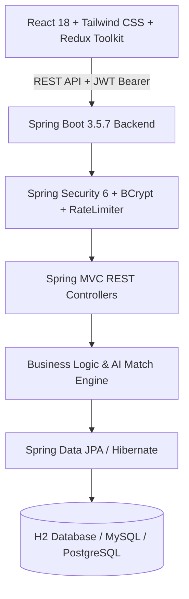

# 🚀 Hire Via — Production-Ready Full-Stack Job Portal & Talent Platform

[](https://spring.io/projects/spring-boot)
[](https://www.oracle.com/java/)
[](https://reactjs.org/)
[](https://vitejs.dev/)
[](https://tailwindcss.com/)
[](https://redux-toolkit.js.org/)
[](https://spring.io/projects/spring-security)
[](LICENSE)

**Hire Via** is a secure, full-stack Job Portal and Talent Acquisition Platform. It connects job seekers with employers through an AI-powered job matching engine, real-time application tracking (ATS), company workspace management, interactive messaging, and role-based access control.

---

## 🏷️ Repository Topics & Technologies

`react` • `vite` • `tailwindcss` • `redux-toolkit` • `material-ui` • `spring-boot` • `java` • `java21` • `spring-security` • `jwt` • `hibernate` • `jpa` • `job-portal` • `recruitment-platform` • `applicant-tracking-system` • `ats` • `ai-job-matching` • `fullstack` • `rest-api` • `h2-database`

---

## 🌟 Key Highlights & Features

### 🛡️ Enterprise-Grade Security & Reliability
- **BCrypt Password Encryption**: Strong salt-based hashing; passwords are never exposed in JSON responses (`@JsonProperty(access = WRITE_ONLY)`).
- **JWT Authentication**: Stateless token generation with custom claims, signed with HMAC-SHA.
- **In-Memory Rate Limiting**: Protects authentication endpoints (`/auth/login`, `/auth/signup`) against brute-force attacks.
- **IDOR Protection**: Strict server-side verification ensures employers can only modify/delete their own job listings and applicants.
- **XSS & Input Sanitization**: HTML tag stripping, script neutralization, and phone/email normalization on all inputs.
- **Unified Global Exception Handling**: Standardized error DTOs (`timestamp`, `status`, `error`, `message`, `validationErrors`) without leaking internal stack traces or SQL schemas.

---

### 🤖 AI-Powered Intelligence Suite
- **AI Job Match & Compatibility Engine**: Real-time compatibility score (%) and skill gap breakdown.
- **AI Cover Letter Auto-Drafter**: 1-click tailored cover letters with Professional, Passionate, and Concise tones.
- **AI Job Role & Specs Suggester**: Automatic generation of industry-standard job descriptions, responsibilities, and required skill sets.

---

### 👨‍💼 Employer / Recruiter Workspace
- **One-Click Job Posting**: Publish listings with detailed descriptions, required skills, salary ranges, and responsibilities.
- **Active Job Management**: Edit, activate/deactivate, or delete job postings with real-time sync.
- **Applicant Tracking System (ATS)**: Review candidate applications, inspect resumes, and update applicant status (`APPLIED` ➔ `SHORTLISTED` ➔ `INTERVIEW` ➔ `HIRED` / `REJECTED`).
- **Company Branding Profile**: Manage company description, website URL, industry sector, location, and logos.
- **Direct Candidate Chat**: Real-time communication with applicants derived strictly from authenticated JWT claims.

---

### 👩‍💻 Candidate Portal
- **Profile & Resume Builder**: Manage bio (up to 1,000 chars), location, years of experience, interactive skill chips, and PDF resume.
- **AI Recommendation Engine**: Automatically matches and ranks live openings based on listed skills, bio keywords, and experience tokens.
- **Single-Click Job Applications**: Apply with a tailored cover letter and resume preview. Prevents duplicate submissions.
- **Saved / Bookmarked Jobs**: Save interesting job openings for later review.
- **Application History**: Track application progress and recruiter status updates in real time.

---

## 🏗️ Architecture & Tech Stack



| Layer | Technologies |
|---|---|
| **Frontend** | React 18, Vite, Redux Toolkit, React Router v7, Material UI (MUI), Tailwind CSS, Formik, Yup, Axios |
| **Backend** | Spring Boot 3.5.7, Java 21, Spring Security 6, Spring Data JPA, Hibernate, Jakarta Validation, Lombok |
| **Security** | BCrypt, JWT (jjwt), Rate Limiting, XSS Input Sanitizer, Global Exception Masking, CORS |
| **Database** | H2 (Embedded Development) / MySQL / PostgreSQL (Production) |

---

## 📁 Project Structure

```
hire-via-job-portal/
├── backend/
│   └── hirevia/
│       ├── pom.xml
│       └── src/main/java/com/hirevia/
│           ├── config/          # Spring Security, JWT Provider, Migration Runner
│           ├── controllers/     # Candidate, Employer & Auth REST Controllers
│           ├── models/          # JPA Entities (User, Job, Company, Application, Chat)
│           ├── repositories/    # Spring Data JPA Repositories
│           ├── requests/        # Validated Jakarta DTO Request Objects
│           ├── responses/       # Standardized Auth & Error Responses
│           ├── service/         # Business Logic Interfaces & Implementations
│           └── util/            # RateLimiterService, InputSanitizer
├── frontend/
│   ├── package.json
│   ├── vite.config.js
│   └── src/
│       ├── components/      # Header, Footer, ProtectedRoutes, JobCard
│       ├── layouts/         # PublicLayout, CandidateLayout, EmployerLayout
│       ├── pages/           # Home, Job Details, Apply, Profile, Dashboard, Auth
│       ├── store/           # Redux Toolkit Slices (Auth, Job, User, Application)
│       └── util/            # Cloudinary uploader & helpers
└── screenshots/             # UI Preview Screenshots
```

---

## 📡 Key REST API Endpoints

### 1. Authentication (`/auth`)
| Method | Endpoint | Description | Access |
|---|---|---|---|
| `POST` | `/auth/signup` | Register a new Candidate or Employer | Public |
| `POST` | `/auth/login` | Authenticate and retrieve JWT Bearer token | Public |

### 2. Job Listings (`/api/jobs` & `/api/employer/jobs`)
| Method | Endpoint | Description | Access |
|---|---|---|---|
| `GET` | `/api/jobs` | Retrieve all active job openings | Public |
| `GET` | `/api/jobs/{id}` | Get detailed job specifications | Public |
| `GET` | `/api/jobs/search?keyword=...` | Search by title, skills, or location | Public |
| `GET` | `/api/jobs/recommended` | AI-matched openings ranked by user skills | Candidate |
| `POST` | `/api/employer/jobs` | Create a new verified job posting | Employer |
| `PUT` | `/api/employer/jobs/update/{id}` | Update existing job posting (IDOR protected) | Employer |
| `DELETE`| `/api/employer/jobs/delete/{id}` | Remove job posting & cascade dependencies | Employer |

### 3. Applications (`/api/applications`)
| Method | Endpoint | Description | Access |
|---|---|---|---|
| `POST` | `/api/applications/apply/{jobId}` | Submit job application with cover letter & resume | Candidate |
| `GET` | `/api/applications/user` | View candidate's submitted applications | Candidate |
| `GET` | `/api/employer/applications/job/{jobId}` | View applicants for a specific employer job | Employer |
| `PUT` | `/api/employer/applications/{id}/status` | Update candidate ATS status (`INTERVIEW`, etc.) | Employer |

### 4. Candidate & Employer Profiles (`/api/users` & `/api/employer/companies`)
| Method | Endpoint | Description | Access |
|---|---|---|---|
| `GET` | `/api/users/profile` | Retrieve candidate profile, skills & resume | Authenticated |
| `PUT` | `/api/users/edit-profile` | Update profile, bio, skills & experience | Authenticated |
| `GET` | `/api/employer/companies/profile` | Retrieve employer company details | Employer |
| `PUT` | `/api/employer/companies/update` | Update company branding, industry & URL | Employer |

---

## ⚡ Getting Started Locally

### Prerequisites
- **Java Development Kit (JDK)**: Version 21 or higher
- **Apache Maven**: 3.8+
- **Node.js**: Version 18 or higher & npm

---

### Step 1: Clone the Repository
```bash
git clone https://github.com/123angmish/hire-via-job-portal.git
cd hire-via-job-portal
```

---

### Step 2: Run Backend Server (Spring Boot)
```bash
cd backend/hirevia

# Build and start the backend on port 8081
mvn spring-boot:run "-Dspring-boot.run.profiles=h2"
```
> The API server will be available at: `http://localhost:8081`  
> H2 Database Console: `http://localhost:8081/h2-console` (JDBC URL: `jdbc:h2:file:./data/hireviadb`, User: `SA`, Password: *(blank)*)

---

### Step 3: Run Frontend Server (React + Vite)
```bash
cd ../../frontend

# Install dependencies
npm install

# Start Vite development server
npm run dev
```
> The application will open at: `http://localhost:5173`

---

## 📄 License
This project is licensed under the **MIT License** — feel free to use and modify for personal and commercial projects.
